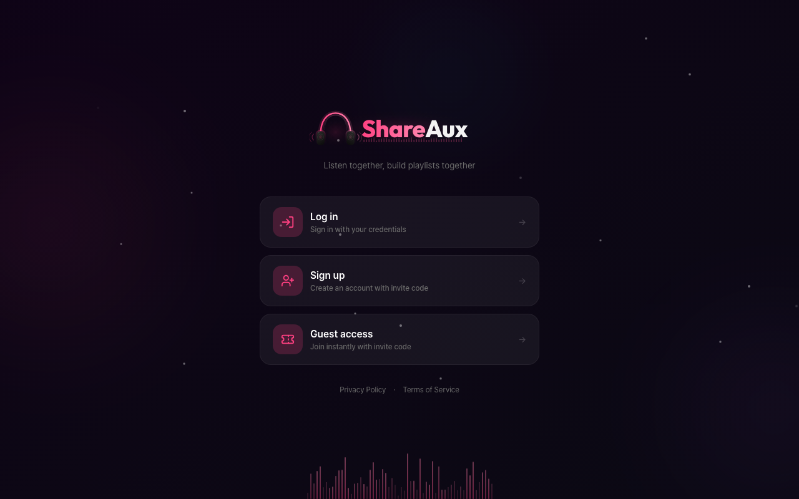

> 🌐 **English** | [한국어](./README.ko.md)

# ShareAux

Self-hosted real-time music sharing platform. Create rooms, search for music together, and stream to all participants via WebSocket — everyone hears the same moment. Synced lyrics, chat, and reactions included.

<p align="center">
  
</p>

## Key Features

- **Real-time Audio Streaming** — WebSocket binary (fMP4 AAC) played via MSE, no file downloads
- **Room-based Listening** — Create/join rooms, synchronized music queue sharing
- **Queue Management** — Drag & drop reordering, vote skip, Auto DJ
- **Synced Lyrics** — Line/word-level karaoke, AI translation (Gemini) & pronunciation guide
- **Chat & Reactions** — Real-time chat, floating emoji reactions
- **Permission System** — Granular per-room + per-account permission management
- **Guest Access** — Invite code based, join without an account
- **Admin Back-office** — Dashboard, user/room/track management, audit logs, IP bans
- **Mobile Ready** — Responsive design, iOS Safari compatible (ManagedMediaSource)
- **i18n** — Korean/English with next-intl, cookie-based locale detection
- **Self-hosted** — GHCR Docker images, single `docker compose up` to run

## Tech Stack

| Layer | Technology |
|-------|-----------|
| Server | NestJS 11, TypeORM, PostgreSQL 16, raw `ws` WebSocket |
| Client | Next.js 16, React 19, Tailwind 4, zustand, react-query, next-intl |
| Auth | Passport (Google OAuth + Local JWT) |
| Audio | media resolver → ffmpeg (fMP4 AAC) → WebSocket binary → Browser MSE |
| Lyrics | syncedlyrics (Musixmatch) + Gemini AI translation |
| Infra | Docker, GitHub Actions, GHCR |

### Why WebSocket instead of HLS/DASH?

ShareAux is built around "listening together in the same room," making real-time sync critical.

| | WebSocket (current) | HLS/DASH |
|---|---|---|
| Latency | 1–2s | 3–10s |
| Sync | All participants hear the same point | Segment-level delay makes sync difficult |
| Server Load | Direct delivery (100 users × 16KB/s ≈ 1.6MB/s) | Same without CDN, lower with CDN |
| External Deps | None | CDN costs if needed |
| Self-hosting | Single server, self-contained | No benefit without CDN |

In a self-hosted environment without CDN, switching to HLS would only increase latency with no load reduction. For rooms under 100 users, direct WebSocket delivery is the simplest and lowest-latency approach.

## Quick Start

### Docker (Recommended)

```bash
# 1. Clone and configure
git clone https://github.com/Protomothis/ShareAux.git
cd ShareAux
cp .env.example .env
# Change JWT_SECRET in .env!
# Google login, lyrics translation, etc. are optional.

# 2. Run (GHCR images — no build needed)
docker compose -f docker-compose.ghcr.yml up -d

# 3. Access
# http://localhost:3001 → Admin account setup screen on first visit.
```

> 💡 To build from source, use `docker compose up -d` instead.

### From Source

See the [Development Guide](docs/development.md) for details.

```bash
# Required: Node.js 22+, PostgreSQL 16, ffmpeg, media resolver, python3

# Start DB
docker compose up db -d

# Start server + client
./dev.sh up
```

## Getting Started

1. **Access** — `http://localhost:3001` (or your configured domain)
2. **Create Admin** — Setup screen appears automatically on first visit
3. **Create Invite Code** — Admin page (`/admin`) → Invite Codes → New
4. **Invite Friends** — Share the code for guest access or registration
5. **Create Room** — Room list → + button → Enter name → Create
6. **Listen Together** — Search tracks → Add to queue → Real-time streaming to all 🎶

> 💡 HTTPS is required for iOS Safari compatibility.

## System Requirements

| Item | Minimum | Recommended |
|------|---------|-------------|
| RAM | 512MB | 1GB+ |
| Disk | 1GB | 5GB+ (track cache) |
| CPU | 1 core | 2+ cores (concurrent streaming) |
| Docker | 20.10+ | Latest |
| Network | WebSocket support required | HTTPS + domain |

### Traffic Estimates (AAC 128kbps)

| Scale | Bandwidth | Memory |
|-------|-----------|--------|
| 1 room × 10 users | ~1.3Mbps | ~100MB |
| 5 rooms × 20 users | ~13Mbps | ~400MB |
| 10 rooms × 50 users | ~64Mbps | ~800MB |
| 10 rooms × 100 users (extreme) | ~128Mbps | ~1GB |

> ffmpeg processes (1 per room) are the main CPU consumer. Memory is Node.js + ffmpeg + WS connections combined.

## Documentation

- [Features](docs/features.md) — Rooms, playback, lyrics, chat, permissions, admin
- [Deployment Guide](docs/deployment.md) — Docker setup, env vars, reverse proxy
- [FAQ](docs/faq.md) — Playback issues, iOS, configuration
- [Development Guide](docs/development.md) — Local dev environment, tools, project structure
- [Architecture](docs/architecture.md) — System design, audio pipeline, WebSocket protocol
- [AI Agent Rules](AGENTS.md) — For AI coding assistants (Copilot, Cursor, Kiro, etc.)

## Environment Variables

See the [Deployment Guide](docs/deployment.md) for the full list.

| Variable | Required | Description |
|----------|----------|-------------|
| `DATABASE_URL` | Yes | PostgreSQL connection string |
| `JWT_SECRET` | Yes | JWT signing secret |
| `GOOGLE_CLIENT_ID` | No | Google OAuth client ID |
| `GOOGLE_CLIENT_SECRET` | No | Google OAuth client secret |
| `GEMINI_API_KEY` | No | Gemini API key (lyrics translation) |
| `CLIENT_URL` | Yes | Client URL (CORS) |

## Project Nature

ShareAux is an **open-source educational and portfolio project** developed to learn and demonstrate web technologies such as real-time audio streaming, WebSocket communication, and MSE (Media Source Extensions). It is not a commercial music streaming service.

- Designed for **private, small-scale, personal use**
- Private operation via invite codes is strongly recommended
- Does not store music files; streams in real-time from external sources
- Copyright compliance for hosted content is the **instance operator's responsibility**
- Includes default privacy policy (`/privacy`) and terms of service (`/terms`). Modify for your deployment
- Google OAuth usage may require a privacy policy URL

## License

AGPL-3.0. See [LICENSE](LICENSE).
