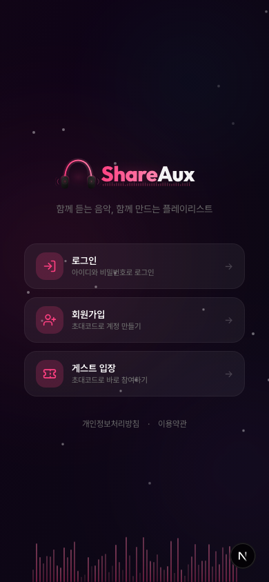
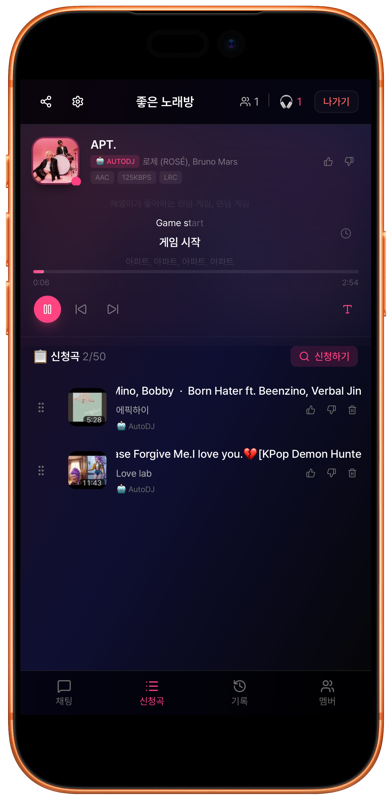

# ShareAux

셀프호스팅 실시간 음악 공유 플랫폼. 방을 만들고, 음악을 검색하고, 모든 참여자에게 동시에 스트리밍합니다.

<p align="center">
  
  &nbsp;&nbsp;&nbsp;&nbsp;
  
</p>

## 주요 기능

- **실시간 오디오 스트리밍** — WebSocket 바이너리(fMP4 AAC)를 MSE로 재생, 파일 다운로드 없음
- **방 기반 청취** — 방 생성/참여, 동기화된 음악 큐 공유
- **큐 관리** — 드래그 앤 드롭 순서 변경, 투표 스킵, Auto DJ
- **싱크 가사** — 줄/워드 단위 카라오케, AI 번역(Gemini) 및 발음 가이드
- **채팅 & 리액션** — 실시간 채팅, 플로팅 이모지 리액션
- **권한 시스템** — 방 단위 + 계정 단위 세분화된 권한 관리
- **게스트 접속** — 초대 코드 기반, 계정 없이 참여 가능
- **관리자 백오피스** — 대시보드, 유저/방/트랙 관리, 감사 로그, IP 차단
- **모바일 대응** — 반응형 디자인, iOS Safari 호환 (ManagedMediaSource)
- **셀프호스팅** — GHCR Docker 이미지, `docker compose up` 한 줄로 실행

## 기술 스택

| 계층 | 기술 |
|------|------|
| 서버 | NestJS 11, TypeORM, PostgreSQL 16, raw `ws` WebSocket |
| 클라이언트 | Next.js 16, React 19, Tailwind 4, zustand, react-query |
| 인증 | Passport (Google OAuth + 로컬 JWT) |
| 오디오 | yt-dlp → ffmpeg (fMP4 AAC) → WebSocket 바이너리 → 브라우저 MSE |
| 가사 | syncedlyrics (Musixmatch) + Gemini AI 번역 |
| 인프라 | Docker, GitHub Actions, GHCR |

## 빠른 시작

### Docker (권장)

```bash
# 1. 클론 및 설정
git clone https://github.com/Protomothis/ShareAux.git
cd ShareAux
cp .env.example .env
# .env 파일에서 JWT_SECRET을 반드시 변경하세요!
# Google 로그인, 가사 번역 등은 선택 사항입니다.

# 2. 실행 (GHCR 이미지 사용 — 빌드 불필요)
docker compose -f docker-compose.ghcr.yml up -d

# 3. 접속
# http://localhost:3001 → 첫 접속 시 관리자 계정 생성 화면이 나타납니다.
```

> 💡 소스에서 직접 빌드하려면 `docker compose up -d`를 사용하세요.

### 소스에서 실행

자세한 내용은 [개발 가이드](docs/development.md)를 참고하세요.

```bash
# 필수: Node.js 22+, PostgreSQL 16, ffmpeg, yt-dlp, python3

# DB 실행
docker compose up db -d

# 서버 + 클라이언트 실행
./dev.sh up
```

## 문서

- [기능 상세](docs/features.md) — 방, 재생, 가사, 채팅, 권한, 관리자 기능 상세
- [배포 가이드](docs/deployment.md) — Docker 설정, 환경 변수, 리버스 프록시
- [개발 가이드](docs/development.md) — 로컬 개발 환경, 필수 도구, 프로젝트 구조
- [아키텍처](docs/architecture.md) — 시스템 설계, 오디오 파이프라인, WebSocket 프로토콜
- [AI 에이전트 규칙](AGENTS.md) — AI 코딩 어시스턴트 사용 시 참고 (Copilot, Cursor, Kiro 등)

## 환경 변수

전체 목록은 [배포 가이드](docs/deployment.md)를 참고하세요.

| 변수 | 필수 | 설명 |
|------|------|------|
| `DATABASE_URL` | O | PostgreSQL 연결 문자열 |
| `JWT_SECRET` | O | JWT 서명 시크릿 |
| `GOOGLE_CLIENT_ID` | - | Google OAuth 클라이언트 ID |
| `GOOGLE_CLIENT_SECRET` | - | Google OAuth 클라이언트 시크릿 |
| `GEMINI_API_KEY` | - | Gemini API 키 (가사 번역) |
| `CLIENT_URL` | O | 클라이언트 URL (CORS) |

## 프로젝트 성격

ShareAux는 실시간 오디오 스트리밍, WebSocket 통신, MSE(Media Source Extensions) 등 웹 기술의 학습과 시연을 위해 개발된 **교육 및 포트폴리오 목적의 오픈소스 프로젝트**입니다. 상업적 음악 스트리밍 서비스가 아닙니다.

- **비공개, 소규모, 개인적 사용**을 전제로 설계되었습니다
- 초대 코드 기반 비공개 운영을 강력히 권장합니다
- 음악 파일을 저장하지 않으며, 외부 소스에서 실시간 스트리밍합니다
- 호스팅된 콘텐츠의 저작권 준수는 **인스턴스 운영자의 책임**입니다
- 개인정보처리방침(`/privacy`)과 이용약관(`/terms`)을 기본 제공합니다. 셀프호스팅 시 운영 환경에 맞게 수정하세요
- Google OAuth 사용 시 개인정보처리방침 URL이 필요할 수 있습니다

## 라이선스

AGPL-3.0. [LICENSE](LICENSE) 파일을 참고하세요.
